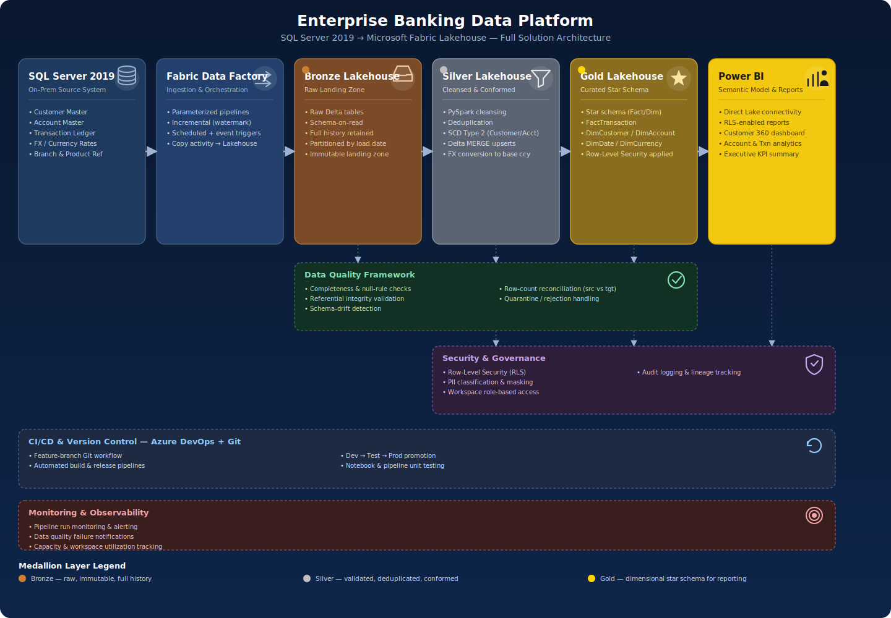

<div align="center">

# 🏦 Enterprise Banking Data Platform
### SQL Server 2019 → Microsoft Fabric Lakehouse Migration

**A production-style data modernization project for the European banking sector**

[](https://www.microsoft.com/en-us/microsoft-fabric)
[](https://spark.apache.org/)
[](https://www.microsoft.com/en-us/sql-server)
[](https://powerbi.microsoft.com/)
[](https://azure.microsoft.com/en-us/products/devops)

<br>



</div>

---

## 📖 Table of Contents

- [Project Overview](#-project-overview)
- [Why This Project](#-why-this-project)
- [Architecture](#-architecture)
- [Technology Stack](#-technology-stack)
- [Skills Demonstrated](#-skills-demonstrated)
- [Project Status & Roadmap](#-project-status--roadmap)
- [Repository Structure](#-repository-structure)
- [Data Model](#-data-model)
- [Author & Contact](#-author--contact)

---

## 📌 Project Overview

**Enterprise Banking Data Platform** is an end-to-end demonstration of migrating a legacy **SQL Server 2019** banking workload to a modern **Microsoft Fabric Lakehouse** architecture. It's modeled on real enterprise data engineering practice in financial services — regulated data domains, layered data quality, and analytics delivered through governed semantic models — rather than a simplified demo dataset.

The platform is being built to reflect the full lifecycle a data engineer owns in a banking environment:

| Stage | What it demonstrates |
|---|---|
| 🏗️ **Data Modeling** | Normalized OLTP schema → dimensional model for a regulated banking domain (Customer, Account, Transaction) |
| 🔄 **Migration & ETL** | Source-to-target mapping and pipeline design from on-prem SQL Server to Fabric |
| 🥉🥈🥇 **Medallion Architecture** | Bronze → Silver → Gold layering in Fabric Lakehouse with clear promotion criteria between layers |
| ⚡ **Transformation at Scale** | PySpark / Spark SQL notebooks for cleansing, conforming, and business-rule logic |
| ✅ **Data Quality** | Validation framework enforcing completeness, accuracy, and referential integrity |
| 📊 **Analytics Delivery** | Power BI semantic model and dashboards built for Direct Lake consumption |
| 🔁 **DevOps** | Git-based version control and Azure DevOps CI/CD for repeatable deployments |

---

## 🎯 Why This Project

Banking data platforms live and die on **auditability, historical accuracy, and trust in the numbers** — not just "does the pipeline run." This project is scoped around the patterns that actually matter in that environment:

- **Traceable lineage** from source system to report, layer by layer
- **Slowly Changing Dimensions** to preserve historical accuracy for customer and account data
- **Explicit data quality gates** between Bronze/Silver/Gold rather than a single opaque transformation step
- **Star-schema Gold layer** tuned for Power BI performance, not just "whatever came out of the source"

It's built as a working reference for how a legacy SQL Server banking workload gets re-platformed onto Microsoft Fabric using enterprise-grade engineering practices — the kind of judgment a hiring manager is actually screening for beyond "knows Python."

---

## 🏗️ Architecture

```
SQL Server 2019  →  Fabric Data Pipeline  →  Bronze  →  Silver  →  Gold  →  Power BI Semantic Model
   (source)            (ingestion)          (raw)    (conformed) (curated)     (analytics)
```

**Design principles**

- **Bronze** — raw, immutable, as-ingested data with full history for reprocessing and audit
- **Silver** — cleansed, deduplicated, validated, and conformed to a shared schema
- **Gold** — dimensional star schema, business-ready and optimized for Power BI Direct Lake
- **Data quality checkpoints** enforced at each layer boundary, not bolted on at the end

*(See the diagram above for the full visual flow.)*

---

## 🛠️ Technology Stack

| Category | Technology |
|---|---|
| **Source Database** | SQL Server 2019 |
| **Cloud Data Platform** | Microsoft Fabric |
| **Data Engineering** | Fabric Data Factory |
| **Processing** | PySpark / Spark SQL |
| **Storage** | Fabric Lakehouse (Delta Lake) |
| **Analytics** | Power BI (semantic models, Direct Lake) |
| **Version Control** | Git & GitHub |
| **CI/CD** | Azure DevOps |
| **Business Domain** | Banking & Financial Services — European Market |

---

## 🧩 Skills Demonstrated

*Mapped to what shows up in Data Engineer / Analytics Engineer job descriptions:*

- ✅ Legacy database migration & re-platforming strategy
- ✅ Medallion (Bronze/Silver/Gold) architecture design
- ✅ Dimensional modeling & star schema design
- ✅ PySpark / Spark SQL transformation development
- ✅ Data quality framework design & implementation
- ✅ Source-to-target mapping & data dictionary documentation
- ✅ Power BI semantic modeling & dashboard delivery
- ✅ CI/CD pipeline design with Azure DevOps
- ✅ Git-based version control & collaborative workflow

---

## 📈 Project Status & Roadmap

### ✅ Phase 1 — Database Foundation *(Completed)*

- [x] Database creation
- [x] Schema design
- [x] Master data implementation
- [x] Stored procedures
- [x] Validation views
- [x] Deployment scripts

### 🔄 Phase 2 — Enterprise Readiness *(In Progress)*

- [ ] Data dictionary
- [ ] ER diagram
- [ ] Source-to-target mapping
- [ ] Customer domain preparation

### 🔜 Phase 3 — Fabric Implementation *(Planned)*

- [ ] Customer 360 data model
- [ ] Fabric Lakehouse implementation (Bronze/Silver/Gold)
- [ ] PySpark transformation notebooks
- [ ] Data quality framework

### 🔜 Phase 4 — Analytics Delivery *(Planned)*

- [ ] Power BI semantic model
- [ ] Banking dashboards (Customer 360, Account, Transaction views)
- [ ] Azure DevOps CI/CD pipeline

---

## 📂 Repository Structure

```
enterprise-banking-data-platform/
├── sql/                      # SQL Server 2019 source database
│   ├── schema/                 # Table definitions, constraints
│   ├── procedures/              # Stored procedures
│   ├── views/                    # Validation & reporting views
│   └── deployment/                # Deployment scripts
├── docs/                     # Data dictionary, ER diagrams, S2T mapping
├── fabric/
│   ├── pipelines/               # Fabric Data Factory pipelines
│   ├── notebooks/                 # PySpark transformation notebooks
│   │   ├── bronze/
│   │   ├── silver/
│   │   └── gold/
│   └── data_quality/             # Data quality framework/notebooks
├── powerbi/                  # Power BI semantic models & dashboards
├── cicd/                     # Azure DevOps pipeline definitions
├── assets/                   # Diagrams and images used in this README
└── README.md
```

*(Structure will be updated as each phase is implemented.)*

---

## 🗃️ Data Model

Core banking entities for the initial scope:

- **Customer** — party/customer master data with SCD Type 2 history
- **Account** — account master linked to customer, product, and currency
- **Transaction** — transaction fact table for analytics and reporting

*Full ER diagram and data dictionary will be published in `/docs` as Phase 2 completes.*

---

## 👤 Author & Contact

**Rakesh Soma**
Data Engineer | BI Engineer | Microsoft Fabric Analytics Engineer Associate

[](https://linkedin.com/in/rakesh-soma)

---

<div align="center">

⭐ *If you find this project useful, consider giving it a star — feedback and suggestions are welcome via Issues.*

</div>
